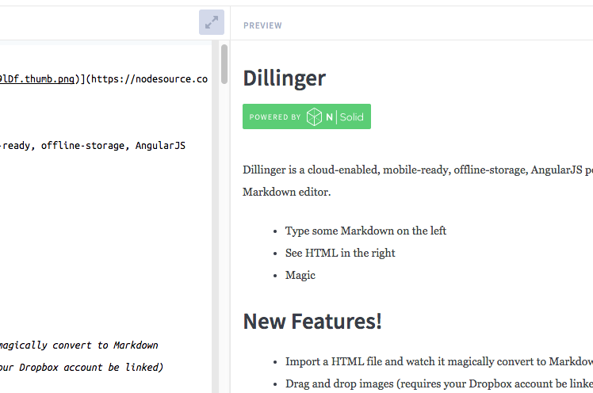

Hello.

This simplistic markdown page shows how to link to images in your markdown files. We will be using screenshots to illustrate our critiques. This way we don't have to take lots of space describing what the website looks like. They are super easy to make once you get used to the procedure.

## How to Make Screenshots
- For Windows: https://support.microsoft.com/en-us/help/13776/windows-use-snipping-tool-to-capture-screenshots.
- For Mac: https://support.apple.com/en-us/HT201361

Remember, you need to save your screenshot image as a separate file that you will upload into the GitHub repository.

## Linking to images in your markdown files
The syntax for displaying an image from your markdown file is as follows:
```

```
You need to replace ALT-TEXT, URL, and HOVER-TEXT for each of your images.

The `URL` is most important; it specifies the virtual location of your image. This is called the image `path`. In this case, we want to specify our `images` folder, because that's where we're uploading all our images.

`ALT-TEXT` is text that will appear if your image cannot be found (usually because there's a typo in the image path) 

`HOVER-TEXT` is text that will appear when you hover the cursor over the image. 

let's try: (you can copy this code into your own markdown page and change the URL to match your image)
```

```


It worked! Above you can see my screen shot I so carefully made in class on Thursday.

As you remember, by dragging and dropping my image file into the images folder (like you have already done with your test markdown files a few weeks ago), I uploaded my image to the `images` folder in the `docs` folder in our repository: https://github.com/unm-digital-futures/digital-history-review. 
